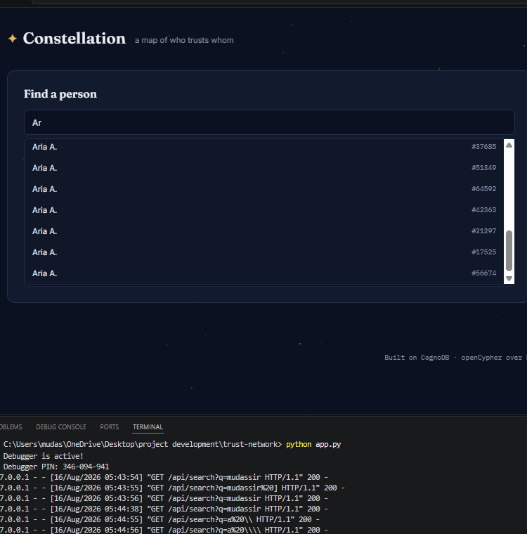
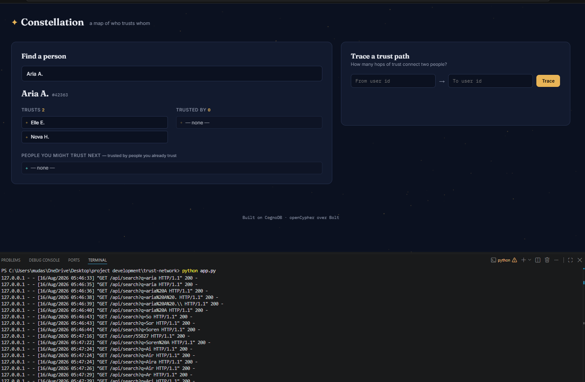
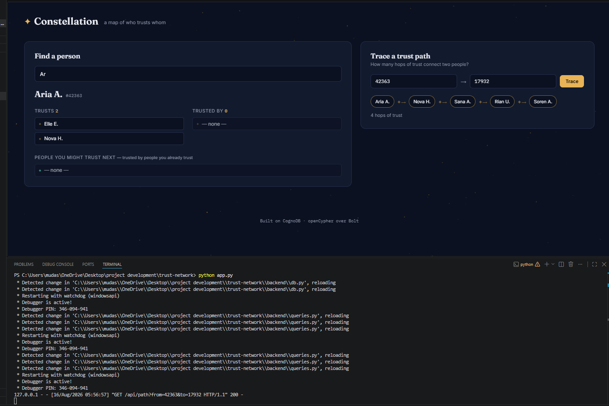
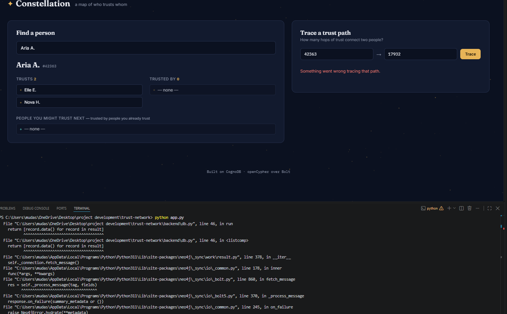

# Constellation — Trust Network Explorer

A small web app for exploring a web-of-trust: who trusts whom, who they might
trust next, and how many hops of trust separate any two people. Built on
**CognoDB** (openCypher over Bolt).

---

## Why a graph database?

Trust is inherently relational — the interesting questions are about paths and
connections, not rows. Three examples from this app show where a graph model
earns its place over a relational schema:

- **Friends-of-friends recommendations** ("people you might trust next")
  require walking two hops: *my trusted contacts → their trusted contacts*,
  filtered down to people I don't already trust. In Cypher this is one
  pattern match. In SQL it's a self-join per hop, and every additional hop
  (3rd-degree, 4th-degree trust) adds another join and gets slower and
  harder to read.

- **Shortest trust path** between two arbitrary users is a classic
  graph-native operation. Cypher's `shortestPath()` handles a variable,
  unknown number of hops natively. The SQL equivalent needs a recursive
  common table expression with a manually bounded depth, and performance
  degrades sharply as the graph grows — there's no clean, fixed-depth SQL
  query for "however many hops it takes."

- **The schema itself grows without migration pain.** Adding a new kind of
  relationship (e.g. `BLOCKS`, `ENDORSES`) is just a new relationship type in
  the graph. In a relational schema, this usually means a new join table and
  reworking every query that needs to consider or exclude it.

None of this is impossible in SQL — it's just consistently more code, more
joins, and more awkward to reason about as the relationships get deeper.

---

## Data model

```
   (:User {id, name})
          │
          │  [:TRUSTS]
          ▼
   (:User {id, name})
```

- **Node label:** `User` — properties: `id` (int, unique), `name` (string)
- **Relationship type:** `TRUSTS` — directed, no properties currently
- **Constraint:** `User.id` is unique (enforced via `CREATE CONSTRAINT`)

The dataset is a directed trust network: `(source)-[:TRUSTS]->(target)` means
`source` trusts `target`. Trust is not assumed to be mutual.

---

## Setup

### 1. Create a CognoDB instance

1. Sign up at [console.cognodb.com/signup](https://console.cognodb.com/signup)
   (free tier, no credit card required).
2. Create a free (c0) instance and pick a region.
3. Copy the connection URI (`bolt+s://<instance-id>.databases.cognodb.cloud`)
   and the generated password for user `cognodb` — the password is shown
   once, so save it immediately.

### 2. Configure the app

```bash
cp .env.example .env
```

Edit `.env` and fill in your real values:

```
COGNODB_URI=bolt+s://<your-instance-id>.databases.cognodb.cloud
COGNODB_USER=cognodb
COGNODB_PASS=<your-generated-password>
```

### 3. Install dependencies

```bash
pip install -r requirements.txt
```

### 4. Add your dataset

Place `nodes.csv` (column: `id`) and `edges.csv` (columns: `source`, `target`)
in a `data/` folder at the project root.

### 5. Load the data

```bash
python scripts/load_data.py
```

This creates a uniqueness constraint on `User.id`, generates a stable
display name for each user, and loads all nodes and edges into CognoDB in
batches of 5,000.

### 6. Run the app

```bash
python app.py
```

Visit `http://127.0.0.1:5000`.

---

## The queries

All Cypher lives in `backend/queries.py`, fully parameterized (no
string-concatenated queries anywhere).

**Direct trust (1 hop)**
```cypher
MATCH (u:User {id: $user_id})-[:TRUSTS]->(trusted:User)
RETURN trusted.id AS id, trusted.name AS name
ORDER BY trusted.name
```
Who a person trusts directly, and who trusts them (the reverse of this
query), shown side by side in the UI.

**Friends-of-friends suggestions (2-hop traversal)**
```cypher
MATCH (me:User {id: $user_id})-[:TRUSTS]->(friend:User)-[:TRUSTS]->(fof:User)
WHERE fof <> me AND NOT (me)-[:TRUSTS]->(fof)
RETURN fof.id AS id, fof.name AS name, count(DISTINCT friend) AS mutual_paths
ORDER BY mutual_paths DESC, fof.name
LIMIT 10
```
People trusted by people I already trust, excluding myself and anyone I
already trust directly. Ranked by how many of my trusted contacts vouch for
them — the more mutual paths, the stronger the signal.

**Shortest trust path (variable-length traversal)**
```cypher
MATCH p = shortestPath(
    (a:User {id: $from_id})-[:TRUSTS*..6]->(b:User {id: $to_id})
)
RETURN [n IN nodes(p) | {id: n.id, name: n.name}] AS path,
       length(p) AS hops
```
The shortest chain of trust connecting any two users, capped at 6 hops. This
is the query that would be genuinely awkward in SQL — an unbounded recursive
join versus one native function call here.

**Search**
```cypher
MATCH (u:User)
WHERE toLower(u.name) CONTAINS toLower($query)
RETURN u.id AS id, u.name AS name
ORDER BY u.name
LIMIT 20
```
Simple substring search powering the search-as-you-type box.

---

## Engineering notes

- Connection details are read from environment variables (`.env`, excluded
  from version control) — never hardcoded or committed.
- `backend/db.py` wraps the driver with connection-error handling: if
  CognoDB is unreachable, the app degrades gracefully (a banner is shown,
  routes return a clear `503` with a friendly message) instead of crashing.
- All queries are parameterized through the Neo4j driver's `parameters`
  argument — no query string is ever built by concatenating user input.

---

## Project structure

```
trust-network/
├── app.py                 # Flask routes
├── backend/
│   ├── db.py               # CognoDB connection + query execution
│   └── queries.py          # All Cypher, parameterized
├── scripts/
│   └── load_data.py        # Seed script: reads CSVs, enriches, loads to CognoDB
├── static/
│   ├── css/style.css
│   └── js/{app.js, starfield.js}
├── templates/
│   └── index.html
├── data/
│   ├── nodes.csv
│   └── edges.csv
├── .env.example
└── requirements.txt
```

---
## Screenshots

**Searching for a person**


**A user's trust network**


**Tracing a trust path between two users**


**Server resource limit reached**


---

## Live demo

_Add your hosted demo link here once deployed._


- **Free-Tier Constraints & Graceful Degradation:** Running ~76K nodes and ~509K relationships pushes close to the 512MB RAM ceiling of CognoDB's free tier (`c0`). Deep or loosely connected graph traversals can occasionally trigger database timeouts (`TransientError`). The backend wraps execution in defensive error handling to catch these limits and surface a friendly message rather than crashing the app.